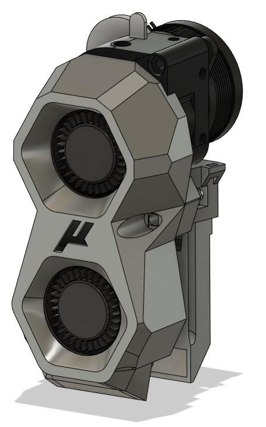

## (Under constuction)Mullet Melter

[Doomcube Discord for support under doomy-worx/Mullet_Melter](https://discord.com/channels/825469421346226226/1028744277393674290)

    

    Frame Extrusions
    

Misumi Part #  |Qty | Notes
 ----|----|----|
HFS3-1515-300 |4 | Blind holes need to be drilled
HFS3-1515-220 |10| Ends need to be tapped (M3)
HFS3-1515-205 |2 |
HFS3-1515-190 |1 |
HFS3-1515-125 |1 |

    

    Linear Rails
    

Part  | Qty | Length
-----|----|-----|
MGN7H | 6 | 150mm
MGN9C | 1 | 150mm

Thanks to the following people on Discord who have helped get this printer finished:

- @test

[You can support the Micron project on Patreon](https://www.patreon.com/user?u=27661824&fan_landing=true).

[Based on the Voron Design 2.4](https://github.com/VoronDesign/Voron-2)
