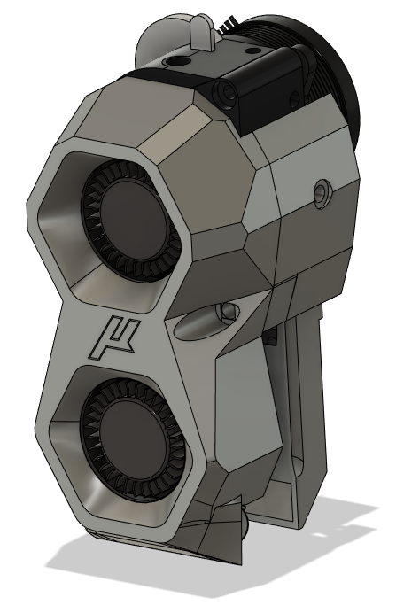

##Mullet Melter

**What is the MulletMelter?**

business in the front, business in the back, party on the sides

[Join the Doomcube Discord for support under doomy-worx/Mullet_Melter](https://discord.com/channels/825469421346226226/1028744277393674290)

**Requires (3) 3010 Blower Fans**

    

    Hardware Required
    

Part           |Qty | Notes
 ----|----|----|
3010 Blower Fan|3 | 
m3x6		   |5 | 
m3x10 		   |4 | 
m3x10 BHCS     |2 | Must be BHCS
m3x12          |2 |
heatset inserts|3 |
LGx Lite       |1 |
Voron Revo     |1 |

Thanks to the following people on Discord who have helped test pre-alpha:
test
- @Dentox_
- @bwnance
